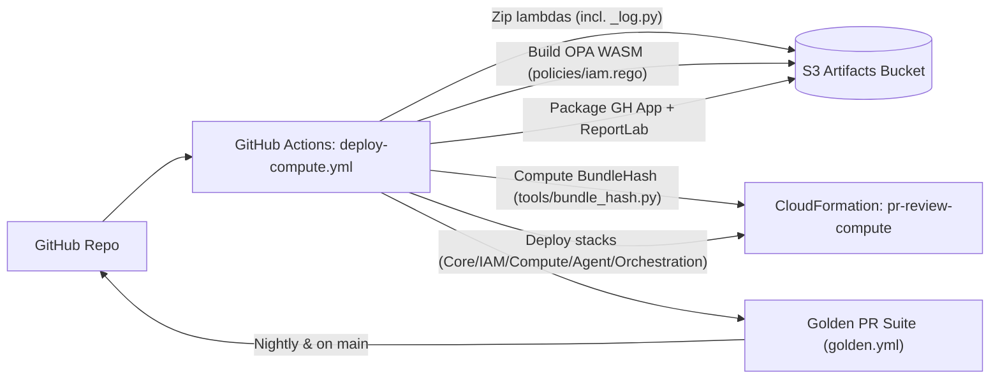
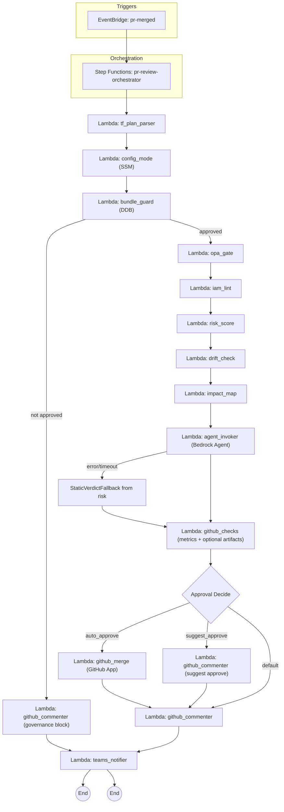
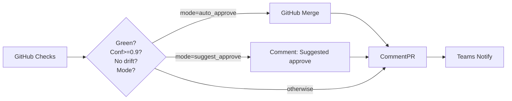

# Flow charts – IAM PR Reviewer

This document presents flow charts for both the CI/CD packaging+deploy process and the runtime orchestration pipeline, including governance and auto‑merge logic.

## 1) CI/CD packaging and deploy (GitHub Actions)

Key outputs

- Uploaded Lambda zips (including opa_gate with WASM, github_app_token/merge, quarterly_report with ReportLab)
- Compute stack deployed with `BundleHash` for governance
- Nightly golden tests enforce regression safety

## 2) Runtime orchestration

Notes

- OPA gate short‑circuits if `deny` contains violations → red path comment (in code: OPAVerdictBlock).
- AgentReview is retried with backoff and falls back to static verdict if Bedrock has errors.
- GitHub Checks always posts a result (success/neutral/failure) with a compact summary and emits CloudWatch metrics.

## 3) Approval/merge branches

Guardrails

- OPA deny = []
- Deterministic checks OK (lint/risk/drift/impact constraints)
- Agent verdict green with high confidence
- Drift = none
- Mode ∈ {suggest_approve, auto_approve}

## 4) Error handling & retries (summary)

- Bedrock/throttle/errors → Step Functions retry with backoff; after max attempts, fallback to static verdict
- GitHub API failures for Checks/Comments → logged; Checks path can be retried at the state machine level if needed
- Governance not approved → immediate block comment + Teams notification
- Missing/invalid plan → parser returns error; pipeline degrades gracefully; golden tests cover malformed/no‑op plans
